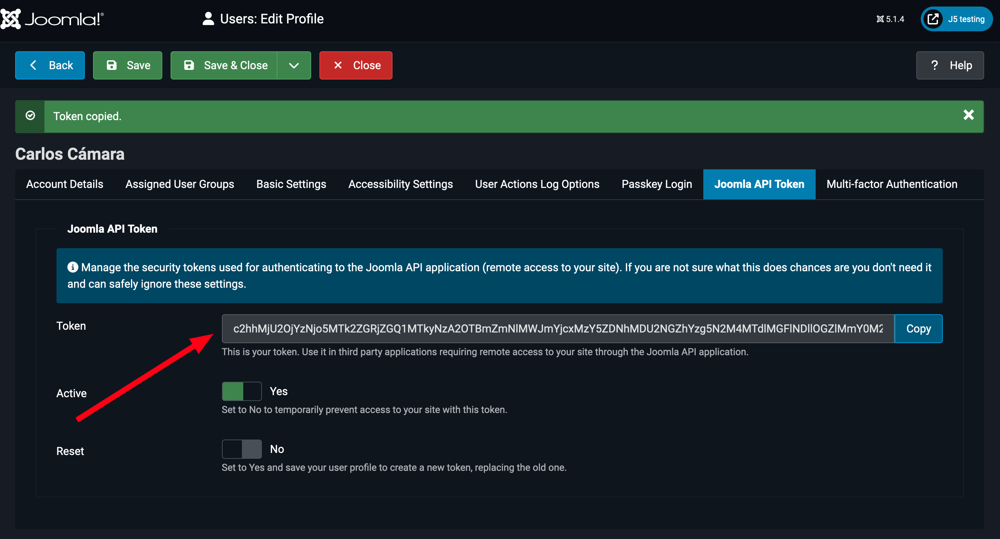

<!--
_class: cover 
-->


---
<!--
_header: "Lo que ya hemos visto"
footer: '[Developing Extensions for Joomla! 5](https://developingextensionsforjoomla5.com/jdayusa2024)'
-->

# ~~Parte 1: Desarrollar una aplicación de lista de deseos para Navidad~~
1. ~~Planificando el componente~~
2. ~~Creando las tablas en la base de datos~~
3. ~~Entendiendo la estructura de carpetas~~
4. ~~Describiendo nuestro componente a Joomla!~~

---
<!--
_header: "Lo que vamos a ver"
-->

## Parte 2: Desarrollando nuestro servicio web
1. Editando nuestros deseos
1. Introducción a los servicios web
2. Enrutando nuestro servicio web
3. ¡A divertirse!

---

<!--
_header: "Editando deseos"
--

<div class="url">https://developingextensionsforjoomla5.com/jdayes2024/live/3-editview</div>


<div class="columns">
<div class="column column__content">

- Fichero: `src/Controller/DeseoController.php`

```php
<?php

namespace Langulero\Component\Aiwfc\Administrator\Controller;

use Joomla\CMS\MVC\Controller\FormController;

\defined('_JEXEC') or die;

class DeseoController extends FormController
{
}
```


</div>
<div class="column column__reference">

### Referencias

Capítulo 2

</div>
</div>

<!--
- Empezamos definiendo el controlador de nuestra entidad
-->

---

<!--
_header: "Editando deseos"
-->

<div class="columns">
<div class="column column__content">

- Fichero: `src/Model/DeseoModel.php`

```php
<?php

namespace Langulero\Component\Aiwfc\Administrator\Model;

use Joomla\CMS\MVC\Model\AdminModel;
use Joomla\CMS\Factory;

\defined('_JEXEC') or die;

class DeseoModel extends AdminModel
{
    public function getForm($data = array(), $loadData = true)
    {
        $form = $this->loadForm(
            'com_aiwfc.deseo',
            'deseo',
            [
                'control' => 'jform',
                'load_data' => $loadData
            ]
        );
        
            if (empty($form)) {
            return false;
        }

        return $form;
    }

    protected function loadFormData()
	{
		$app = Factory::getApplication();
		$data = $app->getUserState(
			'com_aiwfc.edit.deseo.data',
			[]
		);
		if (empty($data)) {
			$data = $this->getItem();
		}
		return $data;
    }
}
```


</div>
<div class="column column__reference">

### Referencias

Capítulo 2

</div>
</div>

<!--
- Empezamos definiendo el controlador de nuestra entidad
-->


---

<!--
_header: "Editando deseos"
-->

<div class="columns">
<div class="column column__content">

- Fichero: `src/View/Deseo/HtmlView.php`

```php

<?php
namespace Langulero\Component\Aiwfc\Administrator\View\deseo;

use Joomla\CMS\Factory;
use Joomla\CMS\Toolbar\Toolbar;
use Joomla\CMS\Toolbar\ToolbarHelper;
use Joomla\CMS\MVC\View\GenericDataException;
use Joomla\CMS\MVC\View\HtmlView as BaseHtmlView;

\defined('_JEXEC') or die;

class HtmlView extends BaseHtmlView
{
    public $state;
    public $item;
    public $form;

    public function display($tpl = null): void
    {
        $this->form = $this->get('Form');
        $this->state = $this->get('State');
        $this->item = $this->get('Item');

        if (count($errors = $this->get('Errors'))) {
            throw new GenericDataException(implode('\n', $errors), 500);
        }

        $this->addToolbar();

        parent::display($tpl);
    }

    protected function addToolbar()
    {
        Factory::getApplication()->input->set('hidemainmenu', true);

        $isNew = ($this->item->id == 0);
        $toolbar = Toolbar::getInstance();

        ToolbarHelper::title(($isNew ? 'Add' : 'Edit'));

        if ($isNew) {
            $toolbar->apply('deseo.save');
        } else {
            $toolbar->apply('deseo.apply');
        }
        $toolbar->save('deseo.save');

        $toolbar->cancel('deseo.cancel', 'JTOOLBAR_CLOSE');
    }
}
```

</div>
<div class="column column__reference">

### Referencias

Capítulo 2

</div>
</div>

<!--
- Empezamos definiendo el controlador de nuestra entidad
-->

---
<!--
_header: "Editando deseos"
-->
<div class="columns">
<div class="column column__content">

Añadimos nuestro formulario: `forms/deseo.xml`.

```xml
<?xml version="1.0" encoding="UTF-8"?>
<form>
    <field name="id" type="hidden" />
    <field name="titulo" type="text" label="Título" required="true" />
    <field name="descripcion" type="editor" label="Descripción" required="false" />
    <field name="creado" type="calendar" default="NOW" label="Creado en" required="false" readonly="true"/>
    <field name="creado_por" type="user" label="Creado por" readonly="true" default="CURRENT" />
</form>

```


</div>
<div class="column column__reference">

### References


Capítulos 2 y 4

</div>
</div>

---
<!--
_header: "Editando deseos"
-->
<div class="columns">
<div class="column column__content">

Modificamos el layout del listado: `tmpl/deseos/default.php`.

Reemplazando:

```html
<div class="item-title">
    <?php echo $item->name; ?>
</div>
```

Por esto:

```php
use Joomla\CMS\Router\Route;
```

```html
<div class="item-title">
  <a href="<?php echo Route::_('index.php?option=com_aiwfc&view=deseo&layout=edit&id=' . (int) $item->id); ?>">
      <?php echo $task->titulo;?>
  </a>
</div>
```


</div>
<div class="column column__reference">

### References


Capítulo 2

</div>
</div>

---

<!--
_header: "Editando deseos"
-->
<div class="columns">
<div class="column column__content">

Añadimos el layout de edición: `tmpl/deseo/edit.php`

```php
<?php

use Joomla\CMS\HTML\HTMLHelper;
use Joomla\CMS\Router\Route;

\defined('_JEXEC') or die;

HTMLHelper::_('behavior.formvalidator');
HTMLHelper::_('behavior.keepalive');

?>
<form action="<?php echo Route::_('index.php?option=com_aiwfc&view=deseo&layout=edit&id=' . (int) $this->item->id); ?>"
            method="post" name="adminForm" id="deseo-form" class="form-validate">
	<div>
		<div class="row">
			<div class="col-md-9">
				<div class="row">
					<div class="col-md-6">
                        <?php echo $this->form->renderField('id'); ?>
						<?php echo $this->form->renderField('titulo'); ?>
						<?php echo $this->form->renderField('descripcion'); ?>
						<?php echo $this->form->renderField('creado'); ?>
                        <?php echo $this->form->renderField('creado_por'); ?>
					</div>
				</div>
			</div>
		</div>
	</div>
	<input type="hidden" name="task" value="">
	<?php echo HTMLHelper::_('form.token'); ?>
</form>
```


</div>
<div class="column column__reference">

### References


Capítulo 2

</div>
</div>

---

<!--
_header: "Introducción a los servicios web"
-->
<div class="columns">
<div class="column column__content">

- Forma de hablar entre máquinas
- Sin HTML, responde en JSON, XML...
- Difícil de probar en un navegador
- 4 verbos: POST, GET, PATCH, DELETE
- Sin sesión de usuario

</div>
<div class="column column__reference">

### References


Capítulo 6

</div>
</div>

---

<!--
_header: "Usando los servicios web en Joomla!"
-->
<div class="columns">
<div class="column column__content">

- POSTMAN, **HOPPSCOTCH**, PHP scripts, cURL, plugins de tu IDE...
- Necesitas crear un token para tu usuario de Joomla en cualquier caso.

</div>
<div class="column column__reference">

### References


Capítulo 6

</div>
</div>

---

<!--
_header: "Creando el token de API"
-->
<div class="columns">
<div class="column column__content">



</div>
<div class="column column__reference">

### References


Capítulo 6

</div>
</div>
<!--
- El API Token es único por usuario
- En un usuario recién creado, no hay API Token. El usuario tiene que guardar su configuración para crearlo
- Solo el usuario puede crear y ver su API Token.
- El API Token no se almacena en la base de datos.
-->

---
<!--
_header: "Creando un punto en entrada para nuestro servicio web"
-->
<div class="url">https://developingextensionsforjoomla5.com/jdayes2024/live/4-web-services-plugin</div>

<div class="columns">
<div class="column column__content">

- Las rutas se añaden con plugins del tipo `webservices`.
- Vamos a desarrollar el plugin y lo instalaremos con el método **Descubrir** . que usamos con el componente.

</div>
<div class="column column__reference">


### References


Capítulo 6


</div>
</div>

---

<!--
_header: "Creando el plugin de servicio web"
-->
<div class="columns">
<div class="column column__content">

Fichero de manifiesto: `plugins/webservices/aiwfc/aiwfc.xml`: 

```xml
<?xml version="1.0" encoding="UTF-8"?>
<extension type="plugin" group="webservices" method="upgrade">
    <name>plg_webservices_aiwfc</name>
    <author><![CDATA[Carlos Cámara]]></author>
    <authorEmail>carlos@hepta.es</authorEmail>
    <authorUrl>https://developingextensionsforjoomla5.com</authorUrl>
    <creationDate>2024-04-12</creationDate>
    <copyright>(C) 2024 Langulero SL.</copyright>
    <license>GNU General Public License version 2 or later; see LICENSE.txt</license>
    <version>0.1.0</version>
    <description><![CDATA[Plugin para enrutar el web service de lal lista de deseos para Joomla!]]></description>
    <namespace path="src">Langulero\Plugin\WebServices\Aiwfc</namespace>
    <files>
        <folder plugin="aiwfc">services</folder>
        <folder>src</folder>
    </files>
</extension>
```

</div>
<div class="column column__reference">

### References


Capítulo 6

</div>
</div>

<!--
- Es el mismo formato que el manifiesto del componente
- Tenemos cuidado de incluirlo en la carpeta`webservices` dentro de la carpeta `plugins`
-->

---

<!--
_header: "Creando el plugin de servicio web"
-->
<div class="columns">
<div class="column column__content">

Fichero: `plugins/webservices/aiwfc/services/provider.php`:

```php
<?php

use Joomla\CMS\Extension\PluginInterface;
use Joomla\CMS\Factory;
use Joomla\CMS\Plugin\PluginHelper;
use Joomla\DI\Container;
use Joomla\DI\ServiceProviderInterface;
use Joomla\Event\DispatcherInterface;
use Langulero\Plugin\WebServices\Aiwfc\Extension\Aiwfc;

\defined('_JEXEC') or die;

return new class () implements ServiceProviderInterface {
    public function register(Container $container): void
    {
        $container->set(
            PluginInterface::class,
            function (Container $container) {
                $plugin     = new Aiwfc(
                    $container->get(DispatcherInterface::class),
                    (array) PluginHelper::getPlugin('webservices', 'aiwfc')
                );
                $plugin->setApplication(Factory::getApplication());

                return $plugin;
            }
        );
    }
};
```

</div>
<div class="column column__reference">

### References


Capítulo 6

</div>
</div>

<!--
- Misma estructura que en el componente
-->

---

<!--
_header: "Creando el plugin de servicio web"
-->
<div class="columns">
<div class="column column__content">

Fichero: `plugins/webservices/aiwfc/src/Extension/Aiwfc.php`: 

```php
<?php
namespace Langulero\Plugin\WebServices\Aiwfc\Extension;
use Joomla\CMS\Plugin\CMSPlugin;
use Joomla\Router\Route;
\defined('_JEXEC') or die;
final class Aiwfc extends CMSPlugin
{
    public function onBeforeApiRoute(&$router)
    {
        $route = new Route(
            ['GET'],
			'v1/aiwfc/deseos/:id',
			'deseos.displayItem',
			['id' => '(\d+)'],
			['component' => 'com_aiwfc']
		);
        $router->addRoute($route);
        $router->createCRUDRoutes(
            'v1/aiwfc/deseos',
            'deseos.displayList',
            ['component' => 'com_aiwfc']
        );
    }
}
```

</div>
<div class="column column__reference">

### References


Capítulo 6

</div>
</div>
<!--
- Dos formas de crear las rutas:
  1. con el método `createCRUDRoutes()` que añade todas las acciones posibles al servicio web.
  2. Con la clase `Route` del Framework de Joomla! que nos permite detallar las acciones a permitir.
- Para entidades individuales, `createCRUDRoutes()` añade automáticamente el parámetro :id a la ruta que indiquemos.
- Los parámetros son: 
   - Ruta del servicio web
   - Controlador que gestionará la petición
   - Componente que gestionará la petición

-->

---
<!--
_header: "Gestionando las peticiones en nuestro componente"
-->
<div class="url">https://developingextensionsforjoomla5.com/jdayes2024/live/5-api</div>

<div class="columns">
<div class="column column__content">

- En Joomla!, creamos el fichero `api/components/com_aiwfc/src/Controller/DeseosController.php`:

```php
```


</div>
<div class="column column__reference">


### References


Capítulo 6


</div>
</div>

<!--

- Extendemos la clase `ApiController` de Joomla, lo que nos ahorrará mucho código, ya que esta clase ya proporciona los métodos básicos como `displayList()` y `add()`.

-->

---

<!--
_header: "Creando el plugin de servicio web"
-->
<div class="columns">
<div class="column column__content">

Modificamos el manifiesto para añadir la API:

```xml
<api>
    <files folder="api/components/com_aiwfc">
        <folder>src</folder>
    </files>
</api>
```

</div>
<div class="column column__reference">

### References


Capítulo 6

</div>
</div>
<!--
- Lo añadimos justo debajo de la sección de `administration`
-->

---

<!--
_header: "Creando el plugin de servicio web"
-->
<div class="columns">
<div class="column column__content">

- Copiamos las carpetas a un lugar seguro:
    - `administrator/components/com_aiwfc``
    - `api/components/com_aiwfc``

- Desinstalamos el componente
- Copiamos de nuevo los ficheros
- Instalamos con Discover

</div>
<div class="column column__reference">

### References


Capítulo 6

</div>
</div>

---

<!--
_header: "En brazos de gigantes"
-->

- Libro online *Joomla Extension Development* by Nicholas Dionysopoulos
  - https://www.dionysopoulos.me/book.html
- Libro de Astrid: *Joomla 4 – Developing Extensions: Step by step to an working Joomla extension*
  - https://a.co/d/1BIVa8j
  - https://web.archive.org/web/20230518080457/https://blog.astrid-guenther.de/en/der-weg-zu-joomla4-erweiterungen/

- Documentación Joomla! para programadores
  - https://manual.joomla.org

  <!-- Si vi más lejos que otros hombres es porque estaba subido a hombros de gigantes. -->
---
<!--
_class: thank-you
footer: ''
-->

<div class="text-huge">
    Thank you!
</div>